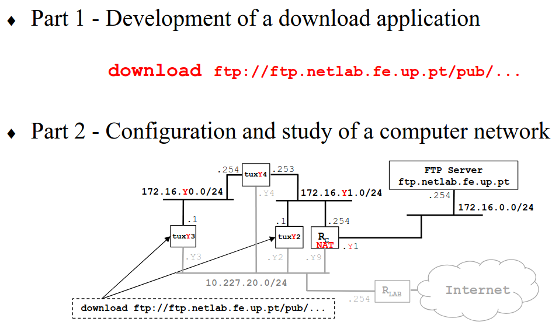

# RCOM Project 2



# Part 2 - Network Configuration

To better understand the following steps and sections, keep in mind the following:

- The Y value that appears throughout the project is the table number (in my case, number 7)
- The schemas that appear below each Exp have grey areas that are used for explanations only, we won’t be implementing any of them
- E(n) is the ethernet connection and the correspondent is eth(n) on the connection area
- tux(n) corresponds to the computers used in the labs that can (and will frequently) be changed using the buttons (in this project, we will mainly use 2, 3 and 4)

## Exp1 - Configure IP Network


For this Exp, we are going to use a switch to connect tuxY3 and tuxY4, where tuxY3 has the ip 172.16.Y0.1/24 and tuxY4 has the ip 172.16.Y0.254/24.

- The first thing to do is to restart the networking service using:
    
    ```bash
    systemctl restart networking
    ```
    
- After this, we need to physically connect the eth1 of tuxY3 to one of the 24 ports below and do the same for eth1 of tuxY4 (keeping in mind which is which):
    
    tuxY3 - port 1
    
    tuxY4 - port 8
    
- For each pc, we are now going to configure the eth1 interfaces using the if config commands, based on slide 46:
    
    
    
    On tuxY3:
    
    ```bash
    ifconfig eth1 up
    ifconfig eth1 172.16.Y0.1/24
    ifconfig # List the MAC and IP addresses
    ```
    
    On tuxY4:
    
    ```bash
    ifconfig eth1 up
    ifconfig eth1 172.16.Y0.254/24
    ifconfig # List the MAC and IP Adresses
    ```
    
- We can now run ifconfig and register the IP and MAC addresses of each tux:
    
    
    | tuxY | 3 | 4 |
    | --- | --- | --- |
    | IP | 172.16.Y0.1 | 172.16.Y0.254 |
    | MAC | 00:01:02:9f:81:2e | 00:0c:df:02:55:95 |
- By running the route -n and arp -a on tuxY3 we can inspect the forwarding and ARP table. We will then delete the ARP entry of tuxY4 using arp -d 172.16.Y0.254
- The final step is to start a capture inside Wireshark on tuxY3 for interface eth1 and then ping the tuxY4 using:
    
    ```bash
    ping 172.16.Y0.254
    ```
    

---

## Exp2 - Implement two bridges in a switch


For this Exp, we are going to continue from the previous switch configuration and create two bridges, one for tuxY3 and tuxY4 and the other for tuxY2.

- The first step is to configure eth1 of tuxY2, just like we did for tuxY3 and tuxY4:
    - Restart network configuration
    - Connect cable, remembering port
        
        tuxY2 - port 16 / 9
        
    - ifconfig with IP 172.16.Y1.1/24
        
        
        | tuxY | 2 | 3 | 4 |
        | --- | --- | --- | --- |
        | IP | 172.16.Y1.1 | 172.16.Y0.1 | 172.16.Y0.254 |
        | MAC | 00:e0:7d:b5:8c:8f | 00:01:02:9f:81:2e | 00:0c:df:02:55:95 |
- Using the commands from slide 50, we are then going to configure the bridges. Note that the following commands must be executed from the GTKTerm
    
    
    
    On tuxY3 (GTK Term):
    
    ```bash
    /interface bridge port print brief
    
    /interface bridge add name=bridgeY0
    /interface bridge add name=bridgeY1
    
    /interface bridge port remove [find interface=ether1]
    /interface bridge port add bridge=bridgeY0 interface=ether1
    
    /interface bridge port remove [find interface=ether8]
    /interface bridge port add bridge=bridgeY0 interface=ether8
    
    /interface bridge port remove [find interface=ether16/9]
    /interface bridge port add bridge=bridgeY0 interface=ether16/9
    ```
    
- The following captures are similar to the ones mentioned before, only changing the commands:
    - 1st capture
        
        On tuxY3:
        
        ```bash
        ping 172.16.Y0.254
        ping 172.16.Y1.1
        ```
        
    - 2nd capture
        
        On tuxY3:
        
        ```bash
        ping -b 172.16.Y0.255
        ```
        
    - 3rd capture
        
        On tuxY2:
        
        ```bash
        ping -b 172.16.Y1.255
        ```
        

---

## Exp3 - Configure a Router in Linux


On tuxY4:

```bash
ifconfig eth2 up
ifconfig eth2 172.16.Y1.253/24
```

- tuxY4 eth2 → port 16

On tuxY3 (GTK Term):

```bash
/interface bridge port print brief

/interface bridge port remove [find interface=ether24/16]
/interface bridge port add bridge=bridgeY1 interface=ether24/16
```

On tuxY4 run the following commands:

```jsx
sysctl net.ipv4.ip_forward=1
sysctl net.ipv4.icmp_echo_ignore_broadcasts=0
```

TuxY4:

eth1 - 00:c0:df:02:55:95

eth2 - 00:01:02:a0:ad:91

No TuxY3:

```jsx
route add -net 172.16.71.0/24 gw 172.16.70.254
```

No TuxY2:

```jsx
route add -net 172.16.70.0/24 gw 172.16.71.253
```

To observe the routes use route -n

---

## Exp4 - Configure a Commercial Router and Implement NAT


First change the connections to connect the router with:

- ether1 to the lab P7.12
- ether2 to the port 20/12
    - connect the ether20/12 to bridgeY1

To configure the IP addresses (GTK Term):

```jsx
/system reset-configuration
/ip address add address=172.16.1.71/24 interface=ether1
/ip address add address=172.16.71.254/24 interface=ether2
```

No TuxY2:

```jsx
route add -net 172.16.70.0/24 gw 172.16.71.253
route add -net 172.16.1.0/24 gw 172.16.71.254
```

No TuxY3:

```jsx
route add -net 172.16.71.0/24 gw 172.16.70.254
route add -net 172.16.1.0/24 gw 172.16.70.254
```

No TuxY4:

```jsx
route add -net 172.16.1.0/24 gw 172.16.71.254
```

No TuxY3 (GTK):

```jsx
/ip route add dst-address=172.16.70.0/24 gateway=172.16.71.253
```

---

### Test Section with/without redirect and from different Tux

No TuxY2:

```jsx
sysctl net.ipv4.conf.eth0.accept_redirects=0
sysctl net.ipv4.conf.all.accept_redirects=0
```

```jsx
route del -net 172.16.70.0 gw 172.16.71.253
traceroute -n 172.16.70.1
...
```

---

No TuxY3:

```bash
ping 172.16.1.10 # Ping the FTP server
```

No GTK Term:

```bash
/ip firewall nat disable 0
```

No TuxY3:

```bash
ping 172.16.1.10 # Ping the FTP server
```

---

## Exp 5 - DNS

For each Tux, write in the file /etc/resolv.conf:

```bash
nameserver 10.227.20.3
```

To test, ping any webserver and save the captures from Wireshark:

```bash
ping google.com
```